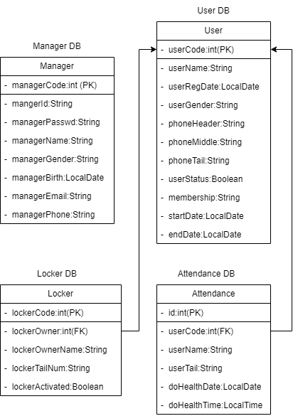
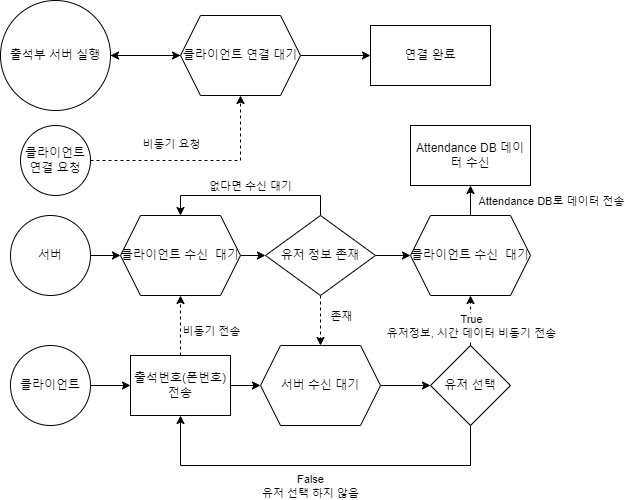

# 프로젝트 (Health Kiosk)

## 설계도

## DB 클래스 다이어그램

## 출석부 서버 설계도

## 간단한 설명
`헬스 키오스크 도메인을 주제로 실제 헬스장에서 사용되고 있는`  
`앱인 브로제이를 참고하여 도메인 설계 및 실제로 구축`  
`전체적으로 `  
`많은 플랫폼 비즈니스에서 사용되고 있는 도메인들인`  
`회원 관리, 출석, 회원등록, 로그인, 회계 관리 관련된 소규모 도메인을`  
`javafx 라이브러리, Scene Builder를 활용하여 프로젝트 실시`

## 시연 영상 v1.0.0
https://youtu.be/pihXkSRuF08

`이 시연 영상은 말이 없습니다. (따라서 이해하기 어려운 부분도 있습니다. 간단히 어떻게 굴러간다는 것만 확인해 주시길 바랍니다.)`
