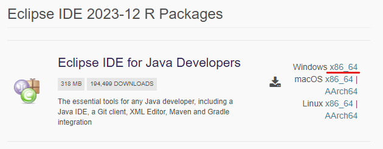

# 초기 셋팅

## Java 17 설치
1. 사이트 접속 후 설치 및 세팅 : <a href="https://www.oracle.com/kr/java/technologies/downloads/#jdk17-windows">OpenJDK-17버전 window 패키지 설치</a>

- 다음 과정을 따라하시면 됩니다.


---


---


---


---


---


---


---


---


---


---


---


- 설정완료 후 cmd(명령프롬프트) 창을 켜서 


- 완료

# Eclipse 설치
1. 사이트 접속 후 설치 및 세팅 : <a href="https://www.eclipse.org/downloads/packages/">eclipse 패키지 설치</a>

- 다음 과정을 따라하시면 됩니다.



- zip파일 다운로드 클릭

- 다운로드 받은 파일 C://Program Files 폴더 밑에다가 압축풀기

- eclipse.exe 파일 바로가기 바탕화면으로 옮기기

- eclipse.exe 실행

- 완료

# JavaFX 설치

1. 사이트 설정 후 설치 및 세팅 : <a href="https://gluonhq.com/products/javafx/">javafx gluon 설치</a>

- 다음 과정을 따라하시면 됩니다.

```
- Downloads 페이지에서

JavaFX Version : 17.0.9 [LTS]
Operating System : Windows
Architecture : x64
Type : SDK
```

- C:/Program Files/Java 폴더 아래에 압축 해제

### eclipse 실행 후

- 다음 과정을 따라하시면 됩니다.

