# 초기 셋팅

## Java 17 설치
1. 사이트 접속 후 설치 및 세팅 : <a href="https://www.oracle.com/kr/java/technologies/downloads/#jdk17-windows">OpenJDK-17버전 window 패키지 설치</a>

- 다음 과정을 따라하시면 됩니다.

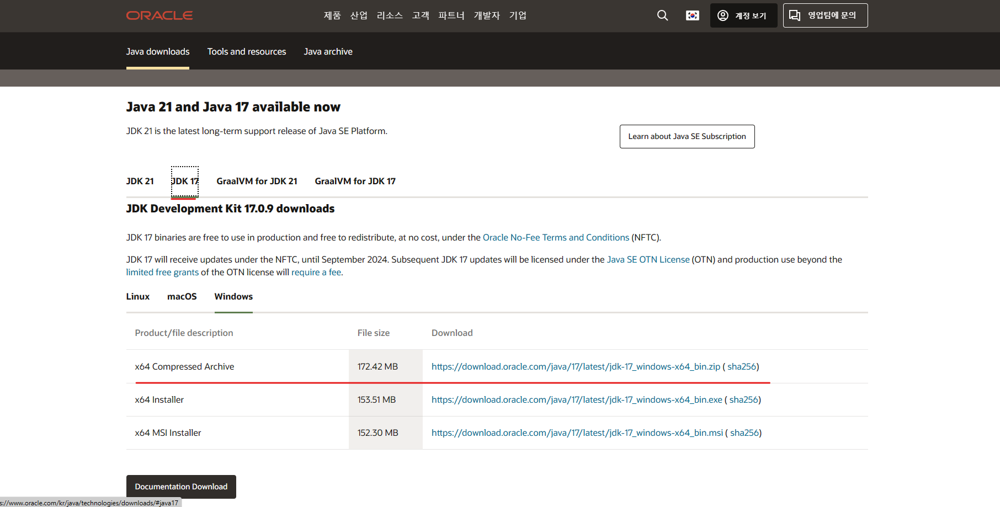

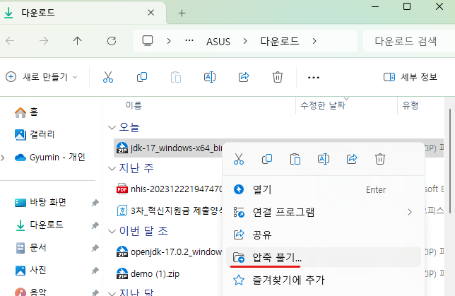

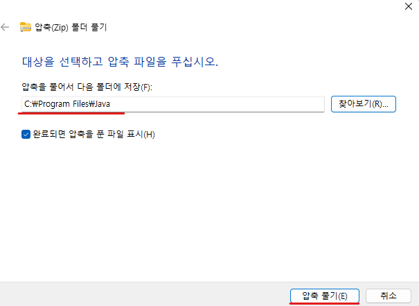

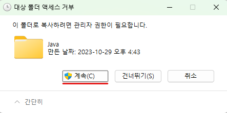

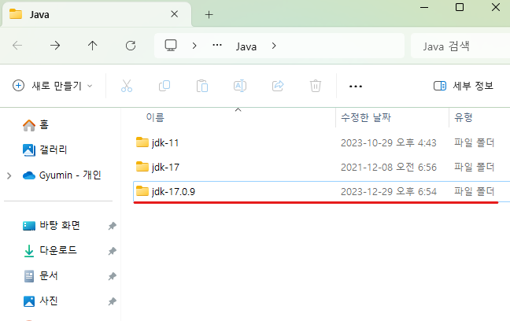

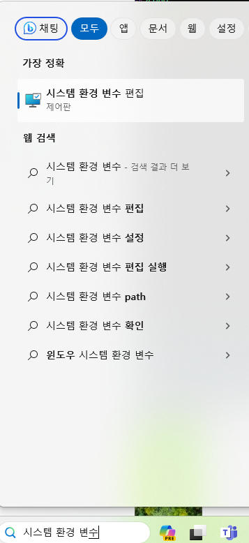

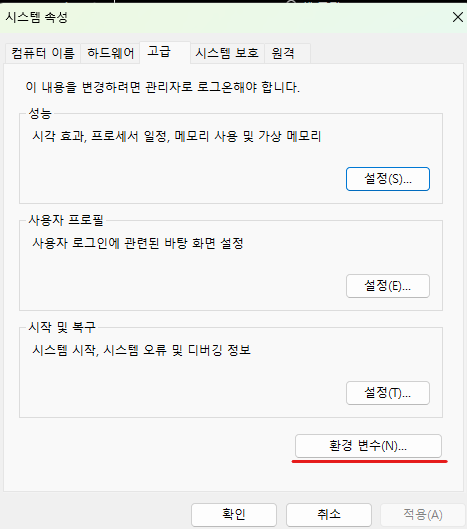

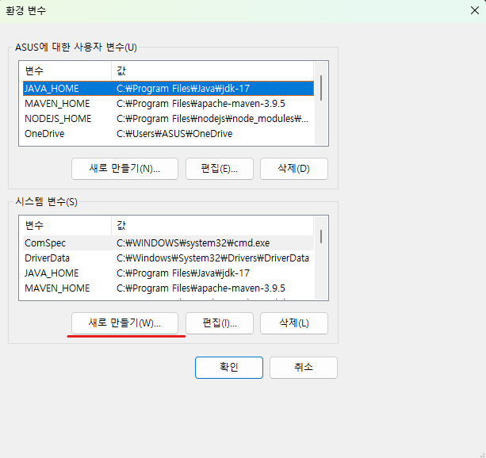

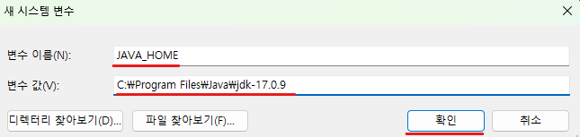

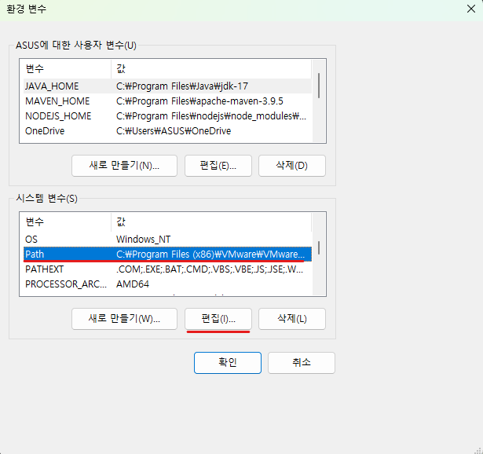

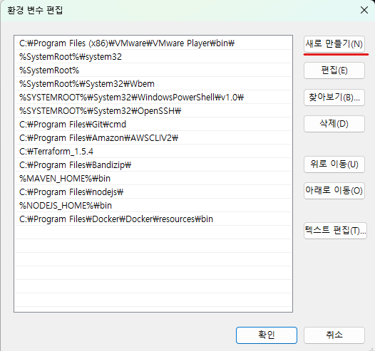

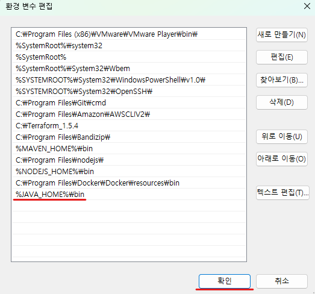

- 설정완료 후 cmd(명령프롬프트) 창을 켜서 

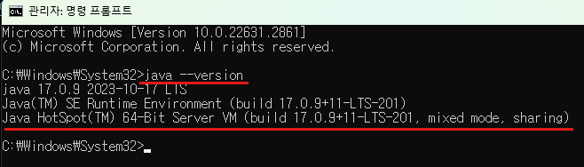

- 완료

# Eclipse 설치
