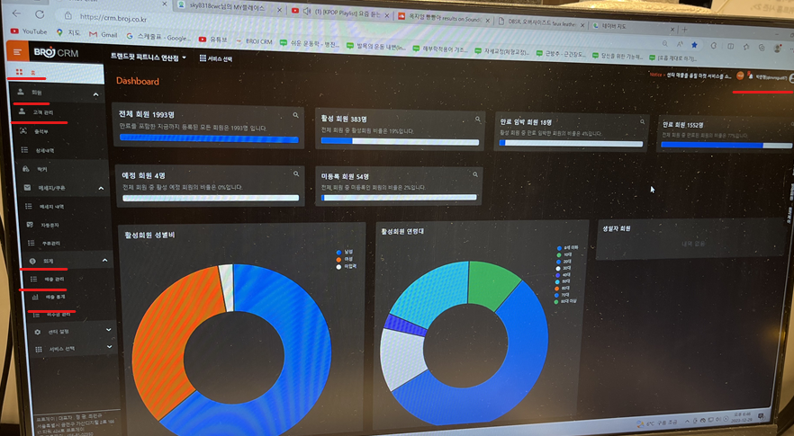

# 2023-12-30

오후 10:00 ~ 10:30


- 홈 page

### 왼쪽 탭
- 홈
- 회원>고객관리
- 회계>매출관리,매출통계

### 오른쪽 상단
- 로그인

```
정리 : 
홈 페이지 그림판or(fxml)
+왼쪽 탭
+오른쪽 상단 로그인페이지

그리고 
왼쪽 탭의 
회계부분
고객관리 부분
어떻게 연결 되는지 글로 정리
```
---


# 2024-01-02

### 고객 관리

- 고객 관리 누른후, 오른쪽 위에 회원추가

- 회원 추가 화면은 (이름, 연락처, 성별) + 결제, 락커, 시작일자

### 출석부

- 들어온 회원의 정보(이름, 연락처, 성별, 출입 시간)

### 락커

- 락커 누른후, 바로 활성화, 비활성화된 화면 창 띄어주기


(로그인), 고객관리 - 김규민
(홈페이지) - 준호
(출석부) - 상엽
(락커) -  상엽

### 